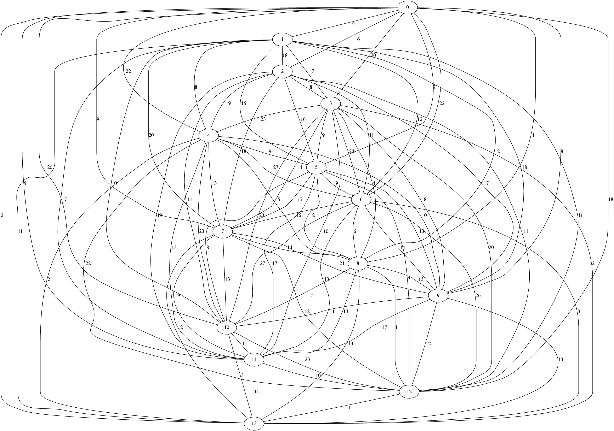

# Availability Matching with Graph Theory

This project pairs participants based on their weekly availability and whether
they are virtual or in-person. It builds a **compatibility graph** from schedule
overlaps and applies **maximum-weight matching** to optimally assign pairs.

## Features
- Reads availability data from `availability.csv`
- Builds a weighted graph using **NetworkX**
- Finds optimal pairings with **maximum-weight matching**
- Visualizes results with **Graphviz**

## Example
This graph shows every potential connection between participants, with edge weights representing compatibility.


After running the algorithm, we retrieve the optimal pairings, with matched pairs highlighted in blue:


## Installation
Clone the repo and install dependencies:
```bash
git clone
cd availability-matching
pip install -r requirements.txt
